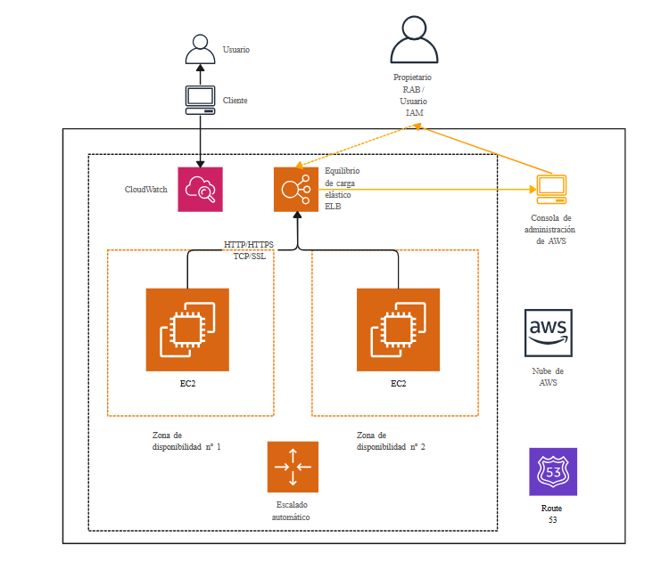

# Proyecto Shopper Franchise API 🏪

Este proyecto es una API RESTful desarrollada con **Spring Boot** que permite gestionar franquicias, sucursales y productos. El sistema facilita la adición, eliminación y modificación de información sobre franquicias, sucursales y productos en diferentes ubicaciones.

---

## Índice 📜

1. [Tecnologías utilizadas](#tecnologías-utilizadas-rocket)
2. [Requisitos previos](#requisitos-previos-⚙️)
3. [Clonar el proyecto](#clonar-el-proyecto-💻)
4. [Ejecutar el proyecto de manera local](#ejecutar-el-proyecto-de-manera-local-🏃‍♂️)
5. [Pruebas y documentación de la API](#pruebas-y-documentación-de-la-api-📚)
6. [Dockerización del Proyecto](#dockerización-del-proyecto-🐳)
7. [Contribución](#contribución-🤝)
8. [Licencia](#licencia)

---

## Tecnologías utilizadas 🚀

- **Spring Boot**: Framework principal para construir la API.
- **Java 17**: Lenguaje de programación utilizado.
- **Maven**: Herramienta para la gestión de dependencias y construcción del proyecto.
- **H2 Database**: Base de datos en memoria para desarrollo local (configurable para usar otros RDBMS como MySQL o PostgreSQL).
- **Docker**: Para crear contenedores de la aplicación.
- **Springdoc OpenAPI**: Para documentar la API utilizando OpenAPI 3.

---

## Requisitos previos ⚙️

1. **Java 17**: Asegúrate de tener instalado Java 17 o superior en tu máquina. Puedes verificar la versión con el comando `java -version`.
   
2. **Maven**: Necesitarás Maven para gestionar dependencias y construir el proyecto. Verifica si Maven está instalado con `mvn -v`.
   
3. **Docker (opcional)**: Si deseas ejecutar la aplicación en un contenedor.

---

## Clonar el proyecto 💻

Para clonar este repositorio en tu máquina local, utiliza el siguiente comando:

git clone https://github.com/tu-usuario/shopper-franchise-api.git

---

## Ejecutar el proyecto de manera local 🏃‍♂️

### Paso 1: Construir el proyecto con Maven

Abre una terminal en la raíz del proyecto y ejecuta el siguiente comando:

mvn clean package

Este comando descargará las dependencias, compilará el código y generará un archivo JAR en el directorio `target/`.

### Paso 2: Ejecutar la aplicación

Una vez que se haya generado el archivo JAR, ejecuta la aplicación con el siguiente comando:

java -jar target/shopper-franchise-api-0.0.1-SNAPSHOT.jar

La aplicación estará disponible en el puerto 8080 por defecto. Puedes acceder a la API en:

http://localhost:8080

---

## Pruebas y documentación de la API 📚

Este proyecto incluye una documentación interactiva de la API generada con Springdoc OpenAPI (Swagger UI). Para acceder a la documentación, abre el navegador y navega a:

http://localhost:8080/swagger-ui.html

En esta interfaz podrás ver todos los endpoints disponibles, realizar pruebas y explorar los detalles de cada operación.

---

## Dockerización del Proyecto 🐳

Si deseas ejecutar la aplicación dentro de un contenedor Docker, sigue estos pasos:

### Paso 1: Construir la imagen Docker

Asegúrate de que el archivo JAR esté construido (ejecuta `mvn clean package`), luego crea la imagen Docker con el siguiente comando:

docker build -t shopper-franchise-api .

### Paso 2: Ejecutar el contenedor Docker

Una vez construida la imagen, ejecuta el contenedor en el puerto 8080 con el siguiente comando:

docker run -p 8080:8080 shopper-franchise-api

La aplicación estará accesible en http://localhost:8080.

---
## AWS  Design

<picture class="container_image-home" data-aos="zoom-in">
                
</picture>
---

## Contribución 🤝

Si deseas contribuir al proyecto, sigue estos pasos:

1. Haz un fork del repositorio.
2. Crea una rama para tu característica: `git checkout -b feature/nueva-funcionalidad`.
3. Realiza tus cambios y haz un commit: `git commit -am 'Agrega nueva funcionalidad'`.
4. Haz push a la rama: `git push origin feature/nueva-funcionalidad`.
5. Crea un pull request para que tu contribución sea revisada.

---

## Licencia

Este proyecto está bajo la Licencia MIT. Consulta el archivo LICENSE para más detalles.
